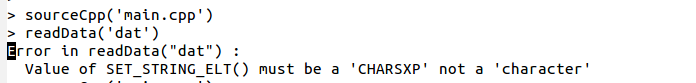

比较
```
Rcpp::Character rline = Rcpp::wrap(line);
```
和
```
Rcpp::CharacterVector rline(2);
rline[0] = line;
//fi >> line;
rline[1] = line;
```

如果
```
Rcpp::CharacterVector rline(2);
rline[0] = Rcpp::wrap(line);
//fi >> line;
rline[1] = Rcpp::wrap(line);
```

会报错


